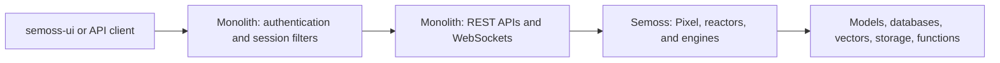

# SEMOSS Monolith

**The web application and API layer for the SEMOSS platform.**

Monolith connects browsers and API clients to the [SEMOSS core runtime](https://github.com/SEMOSS/Semoss). It provides HTTP endpoints, authentication integration, session management, file handling, and WebSocket support, and packages the runtime as a Java web application deployed on Apache Tomcat.

Use Monolith together with [semoss-ui](https://github.com/SEMOSS/semoss-ui) to run the SEMOSS web experience, or call its APIs from your own applications. For examples of a complete infrastructure deployment, see [SEMOSS-deployment](https://github.com/SEMOSS/SEMOSS-deployment).

[Docker quick start](#quick-start-with-docker) · [Build from source](#building-from-source) · [Core documentation](https://github.com/SEMOSS/Semoss/tree/dev/docs) · [Complete deployment examples](https://github.com/SEMOSS/SEMOSS-deployment) · [Issues](https://github.com/SEMOSS/Monolith/issues)

## Contents

- [Responsibilities](#responsibilities)
- [Architecture and related repositories](#architecture-and-related-repositories)
- [Quick start with Docker](#quick-start-with-docker)
- [Complete deployments](#complete-deployments)
- [Building from source](#building-from-source)
- [Development and verification](#development-and-verification)
- [API and health endpoints](#api-and-health-endpoints)
- [Configuration](#configuration)
- [Repository layout](#repository-layout)
- [Documentation](#documentation)
- [Troubleshooting](#troubleshooting)
- [Contributing and support](#contributing-and-support)
- [License](#license)

## Responsibilities

- **HTTP APIs.** Expose Pixel execution and operations on engines, projects, insights, and platform resources through Jakarta REST and RESTEasy.
- **Authentication and sessions.** Integrate login providers, apply servlet filters, and manage user sessions around requests to the core runtime.
- **Streaming and WebSockets.** Support interactive clients and streaming execution results.
- **Web application lifecycle.** Initialize platform resources and expose liveness, readiness, and system-resource status endpoints.
- **Application packaging.** Produce the `monolith` WAR that embeds the SEMOSS core dependency and the web application's resources.

The core implementations of Pixel, reactors, connectors, frames, and engine permissions live in [Semoss](https://github.com/SEMOSS/Semoss). Frontend applications and shared UI libraries live in [semoss-ui](https://github.com/SEMOSS/semoss-ui).

## Architecture and related repositories



Monolith calls the core Java runtime within the web application. A separate network service is not required between Monolith and Semoss.

| Repository | Responsibility | Start here |
| --- | --- | --- |
| **[Monolith](https://github.com/SEMOSS/Monolith)** — this repository | Web application, APIs, authentication integration, and sessions | [Local Docker examples](local-docker-testing/local-docker-compose/README.md) |
| **[Semoss](https://github.com/SEMOSS/Semoss)** | Core runtime, engine integrations, data processing, and language runtimes | [README](https://github.com/SEMOSS/Semoss#readme) and [backend documentation](https://github.com/SEMOSS/Semoss/tree/dev/docs) |
| **[semoss-ui](https://github.com/SEMOSS/semoss-ui)** | Frontend applications and shared UI libraries | [Frontend setup](https://github.com/SEMOSS/semoss-ui#readme) |
| **[SEMOSS-deployment](https://github.com/SEMOSS/SEMOSS-deployment)** | Complete Kubernetes deployment examples and infrastructure configuration | [Deployment guide](https://github.com/SEMOSS/SEMOSS-deployment#readme) |

## Quick start with Docker

**To try the platform using published images**, follow the [Semoss Docker quick start](https://github.com/SEMOSS/Semoss#quick-start-with-docker). It starts the platform and UI without compiling either backend repository.

**To run local backend changes**, use this repository's [local Docker Compose examples](local-docker-testing/local-docker-compose/README.md). They run an image named `local-monolith`, built from sibling Semoss and Monolith checkouts.

### Prerequisites

- Git and Bash.
- **JDK 21** and **Apache Maven 3.9.x**; CI uses Maven 3.9.9.
- Docker with a running daemon and Docker Compose v2 (`docker compose`).
- Access to the configured Maven repositories and container registries, including Quay.io.
- **Trivy** on your `PATH` to complete the build script's final image scan.
- Available host ports **9090** for SEMOSS and **5432** for PostgreSQL.

### Clone and build

Clone both repositories into the same parent directory, preserving the directory names:

```bash
git clone https://github.com/SEMOSS/Semoss.git
git clone https://github.com/SEMOSS/Monolith.git

cd Monolith/local-docker-testing
bash createLocalDockerScript.sh
```

The expected layout is:

```text
workspace/
├── Semoss/
└── Monolith/
    └── local-docker-testing/
```

The [build script](local-docker-testing/createLocalDockerScript.sh) installs Semoss and Monolith with Maven, skips test execution, stages the JavaScript runtime assets, and builds `local-monolith` using the [Dockerfile](local-docker-testing/Dockerfile). Run it from `local-docker-testing/` because its paths are relative to that directory.

The image layers your local WAR and staged JavaScript assets onto a published SEMOSS base that supplies the UI and other runtime assets. Changes to Python, R, other home-directory assets, or semoss-ui need their corresponding packaging or development workflow as well.

The script invokes Trivy after the image is built and writes `results.txt`. Although its message describes scanning as optional, the invocation is unconditional: a missing Trivy executable makes the script exit with an error after the image build. Use `docker image inspect local-monolith` to check whether the image was created.

### Start the application

From `Monolith/local-docker-testing/` after the image build:

```bash
cd local-docker-compose
docker compose -f semoss-with-postgres.yml up -d
docker compose -f semoss-with-postgres.yml logs -f semoss
```

Wait for application startup, then open **[http://localhost:9090/#/](http://localhost:9090/#/)**. The example enables native registration for local use; follow the application's account setup and sign-in flow. The PostgreSQL credentials in the YAML are database credentials, not a SEMOSS user account.

This stack starts the locally built application image and PostgreSQL, initializes the system databases, and persists data in named Docker volumes. Compose creates the network for these Monolith examples automatically. Python is enabled and R is disabled.

From the same directory:

```bash
docker compose -f semoss-with-postgres.yml ps
docker compose -f semoss-with-postgres.yml down
```

`down` retains named volumes. Adding `-v` deletes those volumes and their data.

### Choose an example

| Compose file | Topology | Application URLs |
| --- | --- | --- |
| [semoss-with-postgres.yml](local-docker-testing/local-docker-compose/semoss-with-postgres.yml) | One application node and PostgreSQL | `http://localhost:9090/#/` |
| [semoss-with-postgres-minio.yml](local-docker-testing/local-docker-compose/semoss-with-postgres-minio.yml) | One node, PostgreSQL, and MinIO shared asset storage | `http://localhost:9090/#/` |
| [semoss-with-postgres-minio-redis.yml](local-docker-testing/local-docker-compose/semoss-with-postgres-minio-redis.yml) | Two nodes, PostgreSQL, MinIO, and Redis synchronization | Ports `9090` and `9091` |
| [semoss-with-postgres-minio-zk.yml](local-docker-testing/local-docker-compose/semoss-with-postgres-minio-zk.yml) | Two nodes, PostgreSQL, MinIO, and ZooKeeper synchronization | Ports `9090` and `9091` |

Use the selected filename with `docker compose -f`. Run one platform stack at a time: the examples use fixed container names and host ports that also overlap with the Semoss examples. Stop the existing stack before switching. Cluster variants use `semoss1` and `semoss2` as service names for logs.

These examples use `local-monolith`; do not add `--pull always`, because the image is built locally. See the [Compose guide](local-docker-testing/local-docker-compose/README.md) for supporting service ports and storage behavior. The credentials and native login settings are for local development; configure them for your environment before exposing the application to others.

### FIPS development examples

The [FIPS examples](local-docker-testing/local-docker-compose-fips/README.md) use a separate `local-monolith-fips` image built by [createLocalFipsDockerScript.sh](local-docker-testing/createLocalFipsDockerScript.sh). From `Monolith/local-docker-testing/`:

```bash
bash createLocalFipsDockerScript.sh
cd local-docker-compose-fips
docker compose -f semoss-with-postgres.yml up -d
```

Read that guide before use: it describes the cryptographic provider setup, credential requirements, and expected compatibility failures. These are development and compatibility examples. Stop any regular stack first because the examples use overlapping ports.

## Complete deployments

For Kubernetes and infrastructure deployment, or semoss-artifacts property configuration, see [SEMOSS-deployment](https://github.com/SEMOSS/SEMOSS-deployment).

## Building from source

To build the Java artifacts without creating a container, start from the parent directory containing both repositories:

```bash
cd Semoss
mvn clean install -DskipTests

cd ../Monolith
mvn clean package
```

Monolith produces `target/monolith-<version>.war`. The current build targets Java 21, Tomcat 11, and Jakarta Servlet 6.1; use [pom.xml](pom.xml) as the source of truth for dependency versions. Check `mvn -version` if Maven selects a different JDK from your shell.

### Dependency and profile details

Monolith depends on `org.semoss:semoss:${ci.version}:shaded-dependencies`. The `ci.version` property must match in both POMs. Installing Semoss locally first supplies that dependency for Monolith.

| Profile | Purpose |
| --- | --- |
| `dev` — active by default | Builds the web application with its dependencies for development |
| `deploy` | Produces release packaging, separate library archives, and signed artifacts |
| `fips` | Adjusts cryptographic dependencies for a container-supplied provider; the local FIPS script uses `-P dev,fips` |

A WAR build is one part of a working installation. Running it also requires the SEMOSS home directory, configuration, system databases, runtime dependencies, and frontend assets. The Docker workflows provide that assembled environment.

## Development and verification

For a local change, rebuild and replace the running container. From `Monolith/local-docker-testing/`:

```bash
bash createLocalDockerScript.sh
cd local-docker-compose
docker compose -f semoss-with-postgres.yml up -d --force-recreate semoss
docker compose -f semoss-with-postgres.yml logs -f semoss
```

Restarting an existing container alone does not replace its image. Use your selected Compose filename and service names if running a different topology.

For Java build verification, run `mvn verify` from Monolith. The repository currently has no dedicated test source tree, so a successful build is not API integration coverage. Run the relevant [Semoss tests](https://github.com/SEMOSS/Semoss#running-tests) for core changes and exercise affected API and UI flows against the local stack. The Docker build script skips test execution.

Check that the application starts, sign-in succeeds, the changed operation behaves as expected, and logs show no related startup or request failures. Changes to authentication or filters should also be checked against the intended unauthenticated and unauthorized behavior.

## API and health endpoints

The WAR hosts six REST applications, each mapped separately in [web.xml](WebContent/WEB-INF/web.xml). The paths below use the default `/Monolith` web context. See the [endpoint reference by application](docs/endpoints.md) for methods, engine inputs, compatibility APIs, and supporting resources.

### MonolithApplication — `/Monolith/api`

[MonolithApplication](src/prerna/semoss/web/app/MonolithApplication.java) registers the main runtime APIs. All engine and project routes below include `/api`.

| Entry point / route family | Purpose | Implementation |
| --- | --- | --- |
| `POST /Monolith/api/engine/runPixel` | Execute Pixel in an authenticated application context | [NameServer](src/prerna/semoss/web/services/local/NameServer.java) |
| `POST /Monolith/api/engine/runPixelAsync` | Submit asynchronous Pixel execution | [NameServer](src/prerna/semoss/web/services/local/NameServer.java) |
| `POST /Monolith/api/engine/agentRunStreaming` | Poll live agent events and run status | [NameServer](src/prerna/semoss/web/services/local/NameServer.java) |
| `/Monolith/api/session/*` | Session and insight lifecycle operations | [SessionResource](src/prerna/semoss/web/services/local/SessionResource.java) |
| `/Monolith/api/database-{databaseId}/*` | Database type, reload, and query | [DatabaseEngineResource](src/prerna/semoss/web/services/local/DatabaseEngineResource.java) |
| `/Monolith/api/storage-{storageId}/*` | Storage listing, details, and deletion | [StorageEngineResource](src/prerna/semoss/web/services/local/StorageEngineResource.java) |
| `/Monolith/api/vector-{vectorId}/*` | Vector search and document listing/removal | [VectorEngineResource](src/prerna/semoss/web/services/local/VectorEngineResource.java) |
| `/Monolith/api/model-{modelId}/*` | Generation, streaming, embeddings, and vision | [ModelEngineResource](src/prerna/semoss/web/services/local/ModelEngineResource.java) |
| `/Monolith/api/function-{functionId}/*` | Function execution and definition | [FunctionEngineResource](src/prerna/semoss/web/services/local/FunctionEngineResource.java) |
| `/Monolith/api/e-{engineId}/*` | Shared engine type, configuration, and catalog images | [EngineRouteResource](src/prerna/semoss/web/services/local/EngineRouteResource.java) |
| `/Monolith/api/project-{projectId}/*` | Project reactors, assets, configuration, and images | [ProjectResource](src/prerna/semoss/web/services/local/ProjectResource.java) |
| `/Monolith/api/model/openai/*`, `/Monolith/api/model/anthropic/*`, `/Monolith/api/model/ollama/*` | Model compatibility APIs | [Compatibility routes](docs/endpoints.md#model-compatibility-apis) |
| `/Monolith/api/ext/mcp/{toolbox_id}/comms`, `/Monolith/api/ext/a2a/workspace/{workspaceId}/*` | MCP tools and A2A workspace agents | [Integration routes](docs/endpoints.md#mcp-a2a-and-other-core-resources) |
| `GET /Monolith/api/config/endpoints` | Discover main-application resource methods and paths | [ServerConfigurationResource](src/prerna/semoss/web/services/config/ServerConfigurationResource.java) |

For example, list storage through `POST /Monolith/api/storage-{storageId}/list`, search vectors through `POST /Monolith/api/vector-{vectorId}/query`, or query a database through `POST /Monolith/api/database-{databaseId}/query`. Replace the brace-delimited IDs with accessible catalog IDs. The [engine endpoint tables](docs/endpoints.md#database-engines) specify the supported operations and request fields. Guardrail and virtual-environment operations use their supported Pixel/shared-engine paths; this application does not register dedicated REST resources for them.

### GitHubApplication — `/Monolith/github`

`POST /Monolith/github/webhook` receives GitHub App events and dispatches linked-project synchronization. App setup, user authorization, installation callbacks, and project links are also under `/Monolith/github`. See [GitHub endpoints](docs/endpoints.md#githubapplication).

### MicrosoftGraphApplication — `/Monolith/msgraph`

`POST /Monolith/msgraph/notifications/messages` and `POST /Monolith/msgraph/notifications/events` receive mailbox/calendar notifications and subscription validation. Availability, subscription creation, listing, renewal, and deletion share this application base. See [Microsoft Graph endpoints](docs/endpoints.md#microsoftgraphapplication).

The [webhook guide](https://github.com/SEMOSS/Semoss/blob/dev/docs/integrations/monolith_webhooks.md) covers delivery verification, callbacks, responses, and public URL configuration. Microsoft notifications currently fetch and log changed resources; they do not automatically launch agent runs.

### HealthApplication — `/Monolith/health`

| Method and endpoint | Purpose |
| --- | --- |
| `GET /Monolith/health/` | Liveness |
| `GET /Monolith/health/ready` | Startup readiness: `200` when ready, `503` otherwise |
| `GET /Monolith/health/details` | Required/enabled system-resource status |

[HealthResource](src/prerna/semoss/web/services/config/HealthResource.java) serves these probes without a user session.

### TrustedTokenApplication — `/Monolith/token`

`POST /Monolith/token/getToken` serves the configured trusted integration token flow. A legacy GET variant also exists. See [trusted-token endpoints](docs/endpoints.md#trustedtokenapplication) for the credential behavior.

### AdminApplication — `/Monolith/adminconfig`

`POST /Monolith/adminconfig/setInitialAdmins` supports initial administrator setup. Ongoing administrator operations are part of the main API under `/Monolith/api/auth/admin/*`. See [administrator setup](docs/endpoints.md#adminapplication).

Consult the resource classes for full request and response contracts and send the authentication and CSRF information required by your deployment. See [catalog image uploads](docs/catalog-image-uploads.md) for a complete API example and the [core integration guide](https://github.com/SEMOSS/Semoss/blob/dev/docs/integrations/monolith_interaction.md) for the flow into Pixel and the runtime.

## Configuration

| Configuration area | Where to look |
| --- | --- |
| Servlet routes, filters, sessions, and startup listeners | [WebContent/WEB-INF/web.xml](WebContent/WEB-INF/web.xml) |
| Local container environment and system database connections | [Local Compose files](local-docker-testing/local-docker-compose/README.md) |
| Core runtime and authentication settings | [Semoss configuration guide](https://github.com/SEMOSS/Semoss/blob/dev/docs/development_guides/configuration_and_environment.md) |
| Local Docker networking, volumes, and supporting engines | [Local Docker configuration](https://github.com/SEMOSS/Semoss/blob/dev/docs/deployment/docker_configuration.md) |
| Container startup and semoss-artifacts property configuration | [SEMOSS-deployment](https://github.com/SEMOSS/SEMOSS-deployment) |
| Cluster infrastructure and external services | [SEMOSS-deployment](https://github.com/SEMOSS/SEMOSS-deployment) |

The local examples set `REDIRECT` to the browser URL, enable native registration, and provide `CUSTOM_*` settings for the system databases. MinIO and cluster examples add object storage and coordination settings. Match database configuration to [init.sql](local-docker-testing/local-docker-compose/init.sql).

The local [Dockerfile](local-docker-testing/Dockerfile) preserves `web.xml` from the published base image when replacing Monolith. Changes to this checkout's descriptor therefore do not automatically appear in the locally built container. When testing servlet, filter, or health-route changes, verify the descriptor in the running image matches the configuration you intend to test.

## Repository layout

| Path | Contents |
| --- | --- |
| [src/prerna/semoss/web/app/](src/prerna/semoss/web/app/) | Jakarta REST application registration |
| [src/prerna/semoss/web/services/](src/prerna/semoss/web/services/) | API resource implementations |
| [src/prerna/web/conf/](src/prerna/web/conf/) | Servlet filters, startup listeners, and session integration |
| [src/prerna/websocket/](src/prerna/websocket/) | WebSocket endpoints and streaming support |
| [WebContent/](WebContent/) | Web resources and deployment descriptor |
| [local-docker-testing/](local-docker-testing/) | Local image build scripts, Dockerfiles, and Compose examples |
| [docs/](docs/) | API and feature documentation |
| [pom.xml](pom.xml) | Dependencies, Java compilation, and WAR build profiles |
| [libraries.xml](libraries.xml) and [libraries-fips.xml](libraries-fips.xml) | Library archive assembly descriptors |

## Documentation

- **Find endpoints:** [Endpoints by application](docs/endpoints.md) and [catalog image uploads](docs/catalog-image-uploads.md).
- **Run locally:** [Monolith Compose guide](local-docker-testing/local-docker-compose/README.md), [FIPS examples](local-docker-testing/local-docker-compose-fips/README.md), and [Semoss published-image examples](https://github.com/SEMOSS/Semoss/tree/dev/docker-compose-examples).
- **Add supporting engines:** [Semoss engine examples](https://github.com/SEMOSS/Semoss/blob/dev/docker-compose-examples/engines/README.md) and [local Docker networking](https://github.com/SEMOSS/Semoss/blob/dev/docs/deployment/docker_configuration.md#ports-and-networking).
- **Understand the backend:** [Semoss documentation index](https://github.com/SEMOSS/Semoss/blob/dev/docs/README.md), [architecture](https://github.com/SEMOSS/Semoss/blob/dev/docs/01_backend_architecture_overview.md), and [Monolith integration](https://github.com/SEMOSS/Semoss/blob/dev/docs/integrations/monolith_interaction.md).
- **Develop the frontend:** [semoss-ui](https://github.com/SEMOSS/semoss-ui#readme).
- **Deploy a complete platform:** [SEMOSS-deployment](https://github.com/SEMOSS/SEMOSS-deployment).

## Troubleshooting

| Symptom | What to check |
| --- | --- |
| `cd ../../Semoss` fails in the build script | Keep `Semoss/` and `Monolith/` as siblings and invoke the script from `Monolith/local-docker-testing/`. |
| Maven cannot resolve the SEMOSS dependency | Install Semoss first and confirm the `ci.version` values match. |
| Compilation reports an unsupported release or Java version | Check that `mvn -version` uses JDK 21. |
| Compose cannot find or tries to pull `local-monolith` | Build the image in the same Docker daemon/context used by Compose and avoid `--pull always`. |
| The script fails with `trivy: command not found` | Install Trivy to complete scanning; the image may already exist because scanning follows the Docker build. |
| Container names or ports conflict | Stop the other Monolith or Semoss example and check for a local PostgreSQL service on port 5432. |
| Login redirects incorrectly or does not retain a session | Check `REDIRECT`, the browser-facing scheme and host, and cookie settings for HTTP versus HTTPS. |
| A new route or filter does not appear | Rebuild and recreate the container, then check whether its preserved `web.xml` includes the required mapping. |
| Application startup fails | Inspect `semoss` and `db` logs, database connection settings, and the health details endpoint when configured. |

## Contributing and support

Use [Monolith issues](https://github.com/SEMOSS/Monolith/issues) for web application and API problems. Report core execution and engine issues in [Semoss](https://github.com/SEMOSS/Semoss/issues), and frontend issues in [semoss-ui](https://github.com/SEMOSS/semoss-ui/issues).

Keep pull requests focused and include a description of the behavior, relevant documentation, and build or integration validation. For changes spanning the core and web layer, link the related pull requests and explain version dependencies. The core repository documents the project's [commit message conventions](https://github.com/SEMOSS/Semoss/blob/dev/hooks/README.md).

Bug reports should include the revision or image tag, Java version, deployment topology, reproduction steps, and relevant logs with credentials and private data removed.

## License

See [LICENSE](LICENSE) for the Apache License 2.0 terms. Retain applicable source-file and third-party dependency notices when redistributing the software.
